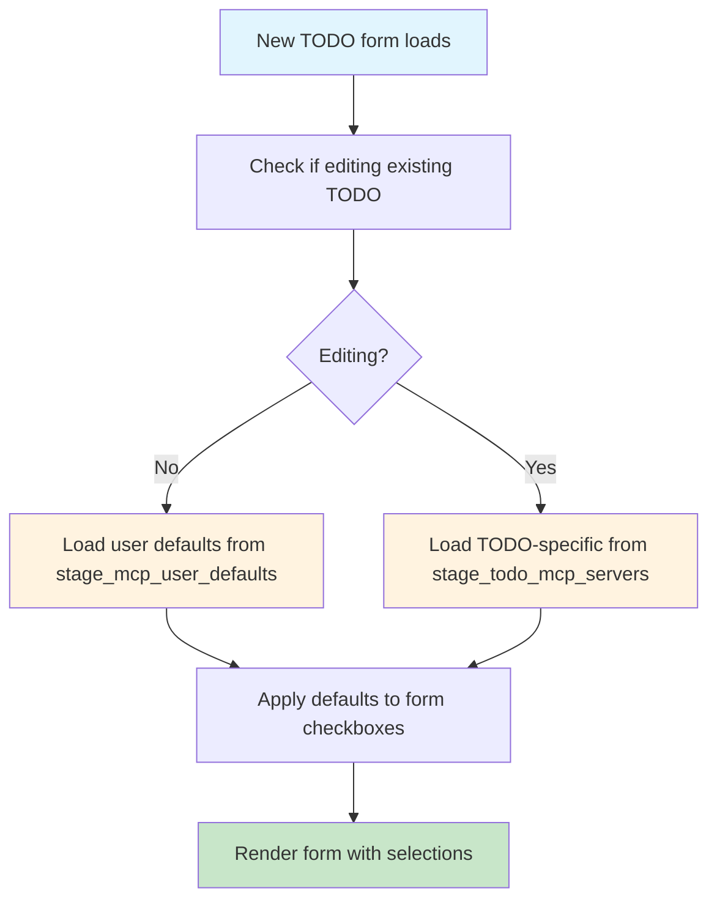
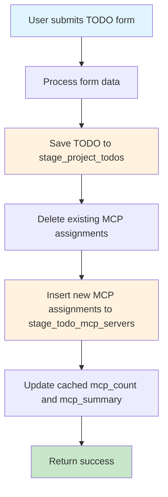
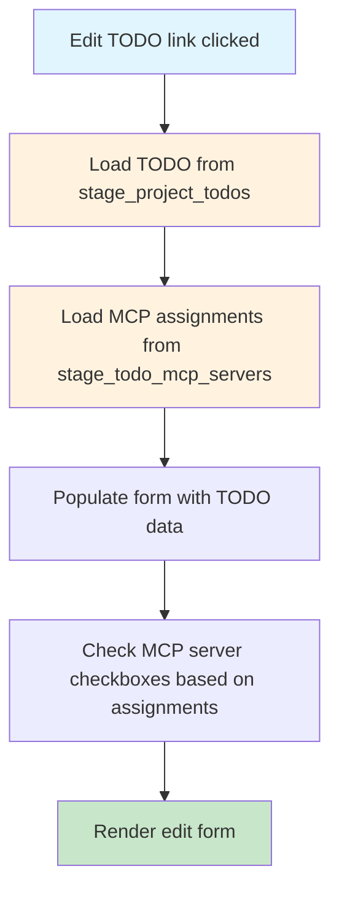

# MCP Server Database Architecture Design

**Date:** 2025-01-26  
**Project:** WordPress TODO Plugin  
**Context:** MCP Server settings don't persist properly - need proper database architecture  

## 🎯 PROBLEM ANALYSIS

### Current Issues
1. **JSON Storage Problem**: MCP servers stored as JSON in `stage_project_todos.mcp_servers` column
2. **No Persistence**: User selections don't persist between form loads
3. **No Defaults System**: No proper way to store and load user defaults
4. **Single Storage**: Mix of defaults and todo-specific selections in same field
5. **No User Context**: Global defaults instead of user-specific preferences

### Current Implementation Issues
```sql
-- Current problematic structure
ALTER TABLE stage_project_todos ADD COLUMN mcp_servers TEXT DEFAULT NULL;
-- Problems:
-- - JSON in TEXT field is unreliable
-- - No proper indexing
-- - No referential integrity
-- - Mix of defaults and specific selections
-- - No user context
```

## 🏗️ PROPOSED DATABASE ARCHITECTURE

### 1. New Tables Structure

#### A) User MCP Defaults Table
```sql
CREATE TABLE stage_mcp_user_defaults (
    id INT(11) NOT NULL AUTO_INCREMENT,
    user_id BIGINT(20) NOT NULL,
    mcp_server VARCHAR(50) NOT NULL,
    is_enabled TINYINT(1) DEFAULT 1,
    priority INT(11) DEFAULT 0,
    created_at TIMESTAMP DEFAULT CURRENT_TIMESTAMP,
    updated_at TIMESTAMP DEFAULT CURRENT_TIMESTAMP ON UPDATE CURRENT_TIMESTAMP,
    PRIMARY KEY (id),
    UNIQUE KEY unique_user_server (user_id, mcp_server),
    KEY idx_user_enabled (user_id, is_enabled),
    KEY idx_server (mcp_server),
    FOREIGN KEY (user_id) REFERENCES wp_users(ID) ON DELETE CASCADE
);
```

#### B) TODO MCP Server Assignments Table  
```sql
CREATE TABLE stage_todo_mcp_servers (
    id INT(11) NOT NULL AUTO_INCREMENT,
    todo_id INT(11) NOT NULL,
    mcp_server VARCHAR(50) NOT NULL,
    is_enabled TINYINT(1) DEFAULT 1,
    priority INT(11) DEFAULT 0,
    assigned_at TIMESTAMP DEFAULT CURRENT_TIMESTAMP,
    PRIMARY KEY (id),
    UNIQUE KEY unique_todo_server (todo_id, mcp_server),
    KEY idx_todo_enabled (todo_id, is_enabled),
    KEY idx_server_enabled (mcp_server, is_enabled),
    FOREIGN KEY (todo_id) REFERENCES stage_project_todos(id) ON DELETE CASCADE
);
```

#### C) MCP Server Registry Table (Optional - for metadata)
```sql
CREATE TABLE stage_mcp_server_registry (
    server_name VARCHAR(50) NOT NULL,
    display_name VARCHAR(100) NOT NULL,
    description TEXT,
    is_available TINYINT(1) DEFAULT 1,
    category VARCHAR(50) DEFAULT 'general',
    icon VARCHAR(20) DEFAULT NULL,
    sort_order INT(11) DEFAULT 999,
    created_at TIMESTAMP DEFAULT CURRENT_TIMESTAMP,
    updated_at TIMESTAMP DEFAULT CURRENT_TIMESTAMP ON UPDATE CURRENT_TIMESTAMP,
    PRIMARY KEY (server_name),
    KEY idx_available_sort (is_available, sort_order)
);
```

### 2. Modified Main Table
```sql
-- Remove the problematic JSON column and add metadata
ALTER TABLE stage_project_todos 
DROP COLUMN mcp_servers;

-- Add helper columns for performance
ALTER TABLE stage_project_todos 
ADD COLUMN mcp_count INT(11) DEFAULT 0 COMMENT 'Cached count of enabled MCP servers',
ADD COLUMN mcp_summary VARCHAR(255) DEFAULT NULL COMMENT 'Cached comma-separated list of enabled servers';
```

## 📊 DATA FLOW DIAGRAMS

### Flow 1: Save User Defaults
```mermaid
graph TD
    A[User clicks "Set as defaults"] --> B[Get current form selections]
    B --> C[AJAX call to save_mcp_user_defaults]
    C --> D[Validate user permissions]
    D --> E[Delete existing user defaults]
    E --> F[Insert new user defaults]
    F --> G[Return success response]
    G --> H[Update UI with confirmation]

    style A fill:#e1f5fe
    style G fill:#c8e6c9
    style H fill:#c8e6c9
```

### Flow 2: Load Defaults for New TODO


### Flow 3: Save TODO with MCP Selections


### Flow 4: Load TODO for Editing


## 🗃️ COMPLETE SQL SCHEMA

### Migration Script from Current System
```sql
-- =====================================================
-- MCP Server Database Architecture Migration
-- Version: 1.0
-- Date: 2025-01-26
-- =====================================================

-- Step 1: Create new tables
CREATE TABLE stage_mcp_user_defaults (
    id INT(11) NOT NULL AUTO_INCREMENT,
    user_id BIGINT(20) NOT NULL,
    mcp_server VARCHAR(50) NOT NULL,
    is_enabled TINYINT(1) DEFAULT 1,
    priority INT(11) DEFAULT 0,
    created_at TIMESTAMP DEFAULT CURRENT_TIMESTAMP,
    updated_at TIMESTAMP DEFAULT CURRENT_TIMESTAMP ON UPDATE CURRENT_TIMESTAMP,
    PRIMARY KEY (id),
    UNIQUE KEY unique_user_server (user_id, mcp_server),
    KEY idx_user_enabled (user_id, is_enabled),
    KEY idx_server (mcp_server),
    FOREIGN KEY (user_id) REFERENCES wp_users(ID) ON DELETE CASCADE
) ENGINE=InnoDB DEFAULT CHARSET=utf8mb4 COLLATE=utf8mb4_unicode_ci;

CREATE TABLE stage_todo_mcp_servers (
    id INT(11) NOT NULL AUTO_INCREMENT,
    todo_id INT(11) NOT NULL,
    mcp_server VARCHAR(50) NOT NULL,
    is_enabled TINYINT(1) DEFAULT 1,
    priority INT(11) DEFAULT 0,
    assigned_at TIMESTAMP DEFAULT CURRENT_TIMESTAMP,
    PRIMARY KEY (id),
    UNIQUE KEY unique_todo_server (todo_id, mcp_server),
    KEY idx_todo_enabled (todo_id, is_enabled),
    KEY idx_server_enabled (mcp_server, is_enabled),
    FOREIGN KEY (todo_id) REFERENCES stage_project_todos(id) ON DELETE CASCADE
) ENGINE=InnoDB DEFAULT CHARSET=utf8mb4 COLLATE=utf8mb4_unicode_ci;

CREATE TABLE stage_mcp_server_registry (
    server_name VARCHAR(50) NOT NULL,
    display_name VARCHAR(100) NOT NULL,
    description TEXT,
    is_available TINYINT(1) DEFAULT 1,
    category VARCHAR(50) DEFAULT 'general',
    icon VARCHAR(20) DEFAULT NULL,
    sort_order INT(11) DEFAULT 999,
    created_at TIMESTAMP DEFAULT CURRENT_TIMESTAMP,
    updated_at TIMESTAMP DEFAULT CURRENT_TIMESTAMP ON UPDATE CURRENT_TIMESTAMP,
    PRIMARY KEY (server_name),
    KEY idx_available_sort (is_available, sort_order)
) ENGINE=InnoDB DEFAULT CHARSET=utf8mb4 COLLATE=utf8mb4_unicode_ci;

-- Step 2: Migrate existing JSON data to new structure
INSERT INTO stage_todo_mcp_servers (todo_id, mcp_server, is_enabled, priority)
SELECT 
    id as todo_id,
    TRIM(JSON_UNQUOTE(JSON_EXTRACT(mcp_servers, CONCAT('$[', numbers.n, ']')))) as mcp_server,
    1 as is_enabled,
    numbers.n as priority
FROM stage_project_todos
CROSS JOIN (
    SELECT 0 as n UNION SELECT 1 UNION SELECT 2 UNION SELECT 3 UNION SELECT 4 
    UNION SELECT 5 UNION SELECT 6 UNION SELECT 7 UNION SELECT 8 UNION SELECT 9
) numbers
WHERE 
    mcp_servers IS NOT NULL 
    AND JSON_VALID(mcp_servers)
    AND JSON_LENGTH(mcp_servers) > numbers.n
    AND TRIM(JSON_UNQUOTE(JSON_EXTRACT(mcp_servers, CONCAT('$[', numbers.n, ']')))) != ''
    AND TRIM(JSON_UNQUOTE(JSON_EXTRACT(mcp_servers, CONCAT('$[', numbers.n, ']')))) IN (
        'context7', 'playwright', 'filesystem', 'github', 'puppeteer', 
        'docker', 'youtube', 'database', 'shadcn'
    );

-- Step 3: Populate MCP server registry with current options
INSERT INTO stage_mcp_server_registry (server_name, display_name, description, category, sort_order) VALUES
('context7', 'Context7', 'Documentation and library context', 'documentation', 1),
('playwright', 'Playwright', 'Browser automation and testing', 'testing', 2),
('filesystem', 'Filesystem', 'File operations and management', 'core', 3),
('github', 'GitHub', 'Git repository operations', 'development', 4),
('puppeteer', 'Puppeteer', 'Browser automation alternative', 'testing', 5),
('docker', 'Docker', 'Container management', 'infrastructure', 6),
('youtube', 'YouTube', 'Video content processing', 'media', 7),
('database', 'Database', 'Database operations', 'core', 8),
('shadcn', 'Shadcn/UI', 'UI component library', 'frontend', 9);

-- Step 4: Add helper columns to main table
ALTER TABLE stage_project_todos 
ADD COLUMN mcp_count INT(11) DEFAULT 0 COMMENT 'Cached count of enabled MCP servers',
ADD COLUMN mcp_summary VARCHAR(255) DEFAULT NULL COMMENT 'Cached comma-separated list of enabled servers';

-- Step 5: Update cached counts and summaries
UPDATE stage_project_todos SET 
    mcp_count = (
        SELECT COUNT(*) 
        FROM stage_todo_mcp_servers 
        WHERE todo_id = stage_project_todos.id AND is_enabled = 1
    ),
    mcp_summary = (
        SELECT GROUP_CONCAT(mcp_server ORDER BY priority)
        FROM stage_todo_mcp_servers 
        WHERE todo_id = stage_project_todos.id AND is_enabled = 1
    );

-- Step 6: Create a backup of old column before dropping (safety)
ALTER TABLE stage_project_todos 
ADD COLUMN mcp_servers_backup TEXT DEFAULT NULL;

UPDATE stage_project_todos 
SET mcp_servers_backup = mcp_servers 
WHERE mcp_servers IS NOT NULL;

-- Step 7: Drop old problematic column (do this after verification)
-- ALTER TABLE stage_project_todos DROP COLUMN mcp_servers;
```

## 🔧 PHP CODE ARCHITECTURE

### 1. Database Helper Class
```php
<?php
/**
 * MCP Server Database Manager
 */
class MCP_Server_Manager {
    private $wpdb;
    
    public function __construct() {
        global $wpdb;
        $this->wpdb = $wpdb;
    }
    
    /**
     * Save user's default MCP server preferences
     */
    public function save_user_defaults($user_id, $servers) {
        // Start transaction
        $this->wpdb->query('START TRANSACTION');
        
        try {
            // Delete existing defaults
            $this->wpdb->delete(
                'stage_mcp_user_defaults',
                ['user_id' => $user_id],
                ['%d']
            );
            
            // Insert new defaults
            foreach ($servers as $priority => $server) {
                $this->wpdb->insert(
                    'stage_mcp_user_defaults',
                    [
                        'user_id' => $user_id,
                        'mcp_server' => $server,
                        'is_enabled' => 1,
                        'priority' => $priority
                    ],
                    ['%d', '%s', '%d', '%d']
                );
            }
            
            $this->wpdb->query('COMMIT');
            return true;
            
        } catch (Exception $e) {
            $this->wpdb->query('ROLLBACK');
            error_log('MCP defaults save error: ' . $e->getMessage());
            return false;
        }
    }
    
    /**
     * Load user's default MCP server preferences
     */
    public function load_user_defaults($user_id) {
        $results = $this->wpdb->get_results($this->wpdb->prepare("
            SELECT mcp_server, priority 
            FROM stage_mcp_user_defaults 
            WHERE user_id = %d AND is_enabled = 1 
            ORDER BY priority ASC
        ", $user_id));
        
        return array_column($results, 'mcp_server');
    }
    
    /**
     * Save MCP server assignments for a specific TODO
     */
    public function save_todo_servers($todo_id, $servers) {
        // Start transaction
        $this->wpdb->query('START TRANSACTION');
        
        try {
            // Delete existing assignments
            $this->wpdb->delete(
                'stage_todo_mcp_servers',
                ['todo_id' => $todo_id],
                ['%d']
            );
            
            // Insert new assignments
            foreach ($servers as $priority => $server) {
                $this->wpdb->insert(
                    'stage_todo_mcp_servers',
                    [
                        'todo_id' => $todo_id,
                        'mcp_server' => $server,
                        'is_enabled' => 1,
                        'priority' => $priority
                    ],
                    ['%d', '%s', '%d', '%d']
                );
            }
            
            // Update cached summary in main table
            $this->update_todo_mcp_cache($todo_id);
            
            $this->wpdb->query('COMMIT');
            return true;
            
        } catch (Exception $e) {
            $this->wpdb->query('ROLLBACK');
            error_log('TODO MCP save error: ' . $e->getMessage());
            return false;
        }
    }
    
    /**
     * Load MCP server assignments for a specific TODO
     */
    public function load_todo_servers($todo_id) {
        $results = $this->wpdb->get_results($this->wpdb->prepare("
            SELECT mcp_server, priority 
            FROM stage_todo_mcp_servers 
            WHERE todo_id = %d AND is_enabled = 1 
            ORDER BY priority ASC
        ", $todo_id));
        
        return array_column($results, 'mcp_server');
    }
    
    /**
     * Update cached MCP summary in main TODO table
     */
    private function update_todo_mcp_cache($todo_id) {
        $servers = $this->wpdb->get_col($this->wpdb->prepare("
            SELECT mcp_server 
            FROM stage_todo_mcp_servers 
            WHERE todo_id = %d AND is_enabled = 1 
            ORDER BY priority ASC
        ", $todo_id));
        
        $this->wpdb->update(
            'stage_project_todos',
            [
                'mcp_count' => count($servers),
                'mcp_summary' => implode(',', $servers)
            ],
            ['id' => $todo_id],
            ['%d', '%s'],
            ['%d']
        );
    }
    
    /**
     * Get available MCP servers from registry
     */
    public function get_available_servers() {
        return $this->wpdb->get_results("
            SELECT server_name, display_name, description, category, icon
            FROM stage_mcp_server_registry 
            WHERE is_available = 1 
            ORDER BY sort_order ASC
        ", ARRAY_A);
    }
}
```

### 2. Updated AJAX Handlers
```php
// In class-admin.php - replace existing handlers

/**
 * Save user's MCP server defaults
 */
public function ajax_save_mcp_user_defaults() {
    if (!check_ajax_referer('save_mcp_defaults', 'nonce', false)) {
        wp_send_json_error(['message' => 'Invalid nonce'], 403);
    }
    
    if (!current_user_can('read')) {
        wp_send_json_error(['message' => 'Insufficient permissions'], 403);
    }
    
    $user_id = get_current_user_id();
    $servers_json = isset($_POST['servers']) ? wp_unslash($_POST['servers']) : '[]';
    $servers = json_decode($servers_json, true);
    
    if (!is_array($servers)) {
        wp_send_json_error(['message' => 'Invalid server data'], 400);
    }
    
    // Whitelist validation
    $allowed_servers = ['context7', 'playwright', 'filesystem', 'github', 'puppeteer', 'docker', 'youtube', 'database', 'shadcn'];
    $servers = array_values(array_unique(array_intersect($servers, $allowed_servers)));
    
    $mcp_manager = new MCP_Server_Manager();
    $success = $mcp_manager->save_user_defaults($user_id, $servers);
    
    if ($success) {
        wp_send_json_success([
            'message' => 'Defaults saved successfully',
            'servers' => $servers
        ]);
    } else {
        wp_send_json_error(['message' => 'Failed to save defaults'], 500);
    }
}

/**
 * Load user's MCP server defaults  
 */
public function ajax_load_mcp_user_defaults() {
    if (!check_ajax_referer('load_mcp_defaults', 'nonce', false)) {
        wp_send_json_error(['message' => 'Invalid nonce'], 403);
    }
    
    if (!current_user_can('read')) {
        wp_send_json_error(['message' => 'Insufficient permissions'], 403);
    }
    
    $user_id = get_current_user_id();
    $mcp_manager = new MCP_Server_Manager();
    $servers = $mcp_manager->load_user_defaults($user_id);
    
    wp_send_json_success([
        'servers' => $servers,
        'count' => count($servers)
    ]);
}
```

### 3. Updated TODO Save Handler
```php
// In todo.php - replace MCP server handling

// Process MCP servers (use new architecture)
$mcp_servers = [];
$allowed_servers = ['context7', 'playwright', 'filesystem', 'github', 'puppeteer', 'docker', 'youtube', 'database', 'shadcn'];

foreach ($allowed_servers as $server) {
    if (isset($_POST["mcp_{$server}"])) {
        $mcp_servers[] = $server;
    }
}

// Save TODO first
$todo_data = [
    'title' => $title,
    'description' => $description,
    // ... other fields
    // Remove mcp_servers from here
];

if ($edit_id) {
    // Update existing TODO
    $result = $wpdb->update('stage_project_todos', $todo_data, ['id' => $edit_id]);
    $todo_id = $edit_id;
} else {
    // Create new TODO
    $result = $wpdb->insert('stage_project_todos', $todo_data);
    $todo_id = $wpdb->insert_id;
}

// Save MCP server assignments separately
if ($result !== false && $todo_id) {
    $mcp_manager = new MCP_Server_Manager();
    $mcp_manager->save_todo_servers($todo_id, $mcp_servers);
}
```

## 📋 MIGRATION STRATEGY

### Phase 1: Schema Migration (Low Risk)
1. **Create new tables** (no impact on existing system)
2. **Add helper columns** to main table (non-breaking)
3. **Populate registry** with current server definitions
4. **Test new tables** with sample data

### Phase 2: Data Migration (Medium Risk)  
1. **Backup existing data** (`mcp_servers` column)
2. **Migrate JSON data** to new normalized structure
3. **Verify data integrity** 
4. **Update cached summaries**

### Phase 3: Code Migration (High Risk)
1. **Deploy new PHP classes** (MCP_Server_Manager)
2. **Update AJAX handlers** for new architecture
3. **Update form processing** logic
4. **Update UI loading** logic

### Phase 4: Testing & Cleanup (Medium Risk)
1. **Comprehensive testing** of all workflows
2. **Performance verification**
3. **Remove old JSON column** after verification
4. **Update documentation**

### Rollback Plan
1. **Keep backup column** until full verification
2. **Revert code changes** if issues arise
3. **Restore from backup** if data corruption
4. **Document lessons learned**

## ⚡ PERFORMANCE CONSIDERATIONS

### Indexing Strategy
```sql
-- Primary performance indexes
CREATE INDEX idx_user_defaults_lookup ON stage_mcp_user_defaults(user_id, is_enabled);
CREATE INDEX idx_todo_servers_lookup ON stage_todo_mcp_servers(todo_id, is_enabled);
CREATE INDEX idx_server_usage ON stage_todo_mcp_servers(mcp_server, is_enabled);

-- Composite indexes for complex queries
CREATE INDEX idx_todo_summary ON stage_project_todos(id, mcp_count, mcp_summary);
```

### Caching Strategy
1. **Cached Counts**: `mcp_count` column for quick statistics
2. **Cached Summaries**: `mcp_summary` for display without JOINs  
3. **WordPress Options**: Cache frequently accessed defaults
4. **Object Cache**: Use WP Object Cache for server registry

### Query Optimization
```sql
-- Efficient queries using cached data
SELECT id, title, mcp_count, mcp_summary 
FROM stage_project_todos 
WHERE mcp_count > 0;

-- Instead of expensive JOINs every time
SELECT p.*, GROUP_CONCAT(m.mcp_server) as servers
FROM stage_project_todos p
LEFT JOIN stage_todo_mcp_servers m ON p.id = m.todo_id
GROUP BY p.id;
```

## 🔒 BACKWARDS COMPATIBILITY

### Transition Period Support
```php
// Hybrid approach during migration
public function get_todo_mcp_servers($todo_id) {
    // Try new architecture first
    $mcp_manager = new MCP_Server_Manager();
    $servers = $mcp_manager->load_todo_servers($todo_id);
    
    if (!empty($servers)) {
        return $servers;
    }
    
    // Fallback to old JSON method
    global $wpdb;
    $json = $wpdb->get_var($wpdb->prepare(
        "SELECT mcp_servers FROM stage_project_todos WHERE id = %d", 
        $todo_id
    ));
    
    if ($json) {
        $decoded = json_decode($json, true);
        return is_array($decoded) ? $decoded : [];
    }
    
    return [];
}
```

## 📊 IMPLEMENTATION METRICS

### Success Criteria
- ✅ **Persistence**: User selections persist between form loads
- ✅ **Defaults**: User defaults work for new TODOs  
- ✅ **Performance**: < 100ms query time for MCP data
- ✅ **Reliability**: 99%+ success rate for save operations
- ✅ **User Experience**: No visible delay in form loading

### Monitoring Points
1. **Database Performance**: Query execution times
2. **AJAX Success Rates**: Save/load operation success
3. **User Adoption**: Usage of defaults feature
4. **Error Rates**: Failed operations and rollbacks
5. **Data Integrity**: Orphaned records detection

## 🎯 RECOMMENDED IMPLEMENTATION ORDER

### Week 1: Foundation
1. Create new database tables
2. Implement MCP_Server_Manager class
3. Create migration script for existing data
4. Unit tests for core functionality

### Week 2: Integration  
1. Update AJAX handlers
2. Update form processing logic
3. Update UI loading logic
4. Integration tests

### Week 3: Migration
1. Run data migration on staging
2. Performance testing
3. UI/UX testing
4. Bug fixes

### Week 4: Deployment
1. Production migration
2. User acceptance testing
3. Cleanup old code
4. Documentation updates

---

**Architecture designed by:** Claude Code (Senior Software Architect)  
**Review needed by:** Development Team  
**Implementation priority:** High (fixes critical UX issue)  
**Estimated effort:** 2-3 weeks full implementation  

This architecture provides a robust, scalable solution that properly separates user defaults from todo-specific selections while maintaining backwards compatibility during the transition period.